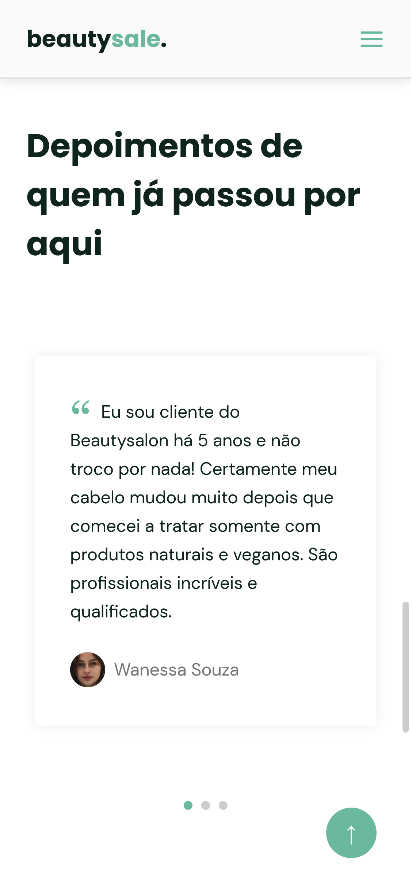

<h1 align="center">
     💆‍♀️ <a href="#" alt="site do beautysalon"> BeautySalon </a>
</h1>

<h3 align="center">
    💇 Saúde natural para os seus cabelos, especializado em tratamentos naturais. 💜
</h3>

  

  

  

  
    
  </a>

<h4 align="center">
	🚧  Concluído 🏅 🚧
</h4>

Tabela de conteúdos
=================
<!--ts-->
   * [Sobre o projeto](#-sobre-o-projeto)
   * [Funcionalidades](#-funcionalidades)
   * [Layout](#-layout)
     * [Mobile](#mobile)
     * [Web](#web)
   * [Bibliotecas](#-bicliotecas)

<!--te-->

## 💻 Sobre o projeto

💇 BeautySalon - é um site no formato de one page que visa trazer informações especificas de uma empresa, gerando assim lead para contato via WhatsApp onde será realizado o agendamento com o cliente diretamente com o vendedor/comunicação da empresa.

Projeto desenvolvido durante a **NLW Together - Missão Origin** oferecida pela [Rocketseat](https://nextlevelweek.com/pre-nlw).
O NLW é uma experiência online com muito conteúdo prático, desafios e hacks onde o conteúdo fica disponível durante uma semana.

---

## ⚙️ Funcionalidades

- [x] Empresas podem utilizar o mesmo template do site porém alterando:
  - [x] Cores
  - [x] Fontes
  - [x] Informações personalizadas da empresa

- [x] Site totalmente responsivo para:
  - [x] Mobile
  - [x] Tablet
  - [x] Notebook
  - [x] Computadores
  - [x] Tela Ultra Wide

## 🎨 Layout

O layout da aplicação está disponível no Figma:

### Mobile

  

  

  

### Web

  

  

  

  

## 📚 Bibliotecas
- [x] [SWIPER JS](https://swiperjs.com/)
- [x] [SCROLLREVEAL](https://scrollrevealjs.org/)
- [x] [ICONMOON APP](https://icomoon.io/app/)

## 🦸 Dev

<a href="https://www.instagram.com/lucasssdo/">
 
  
 <b>Lucas Samuel  👨‍💻 💻</b>
  
</a>